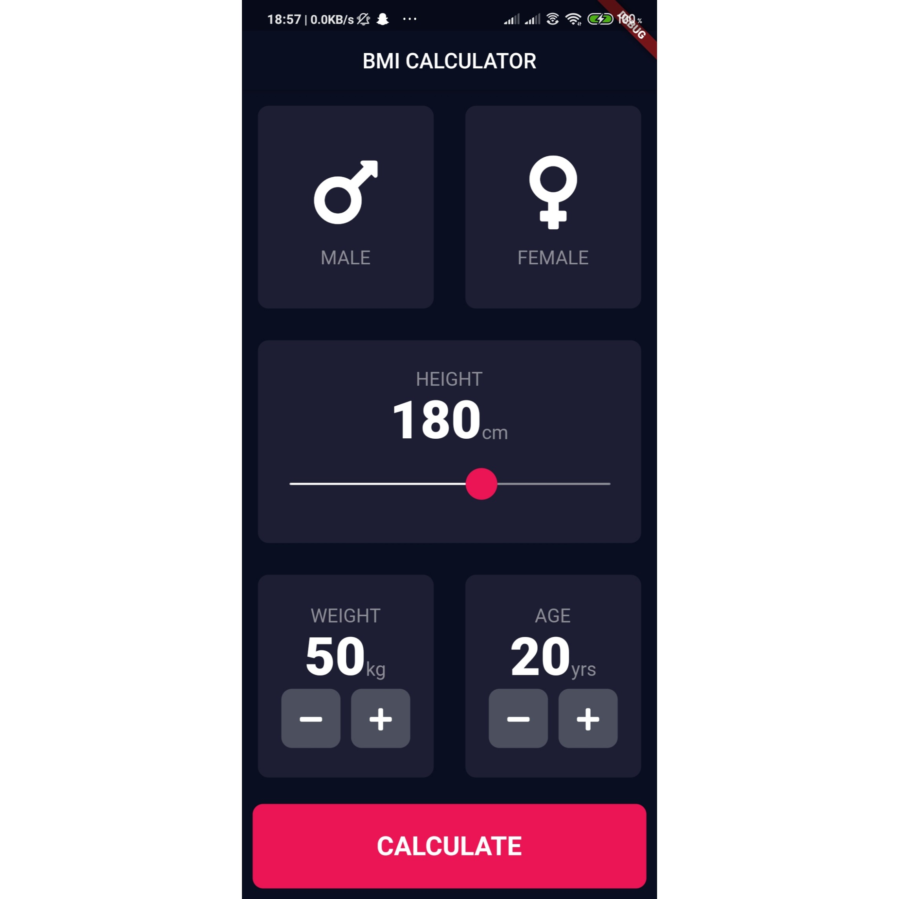
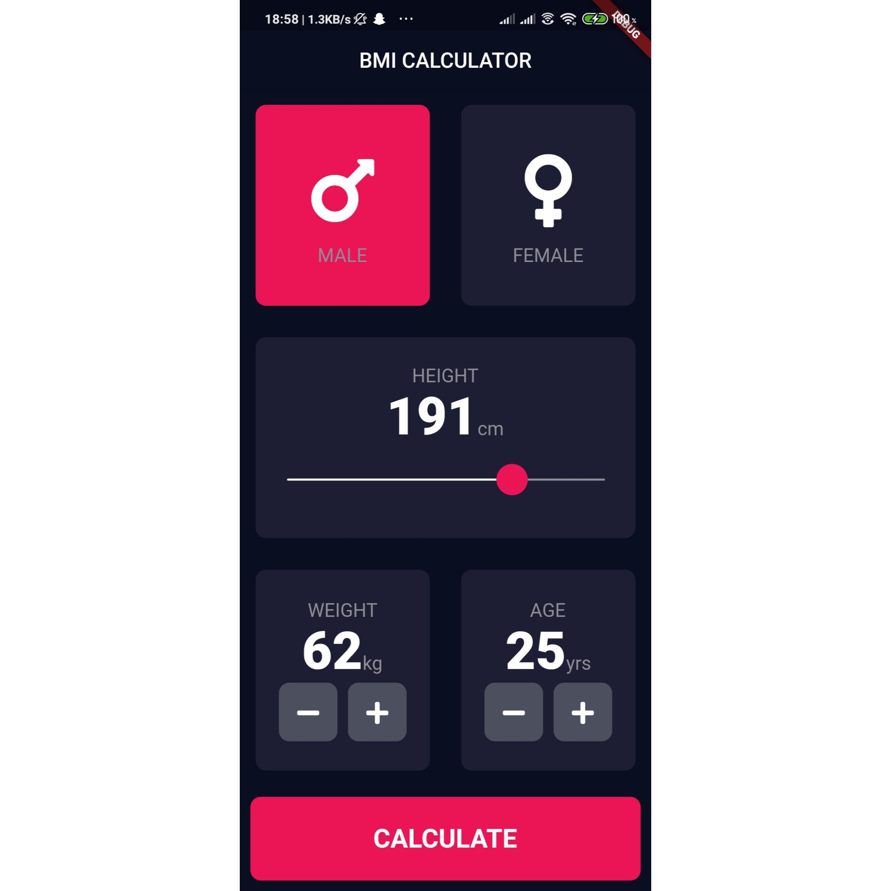
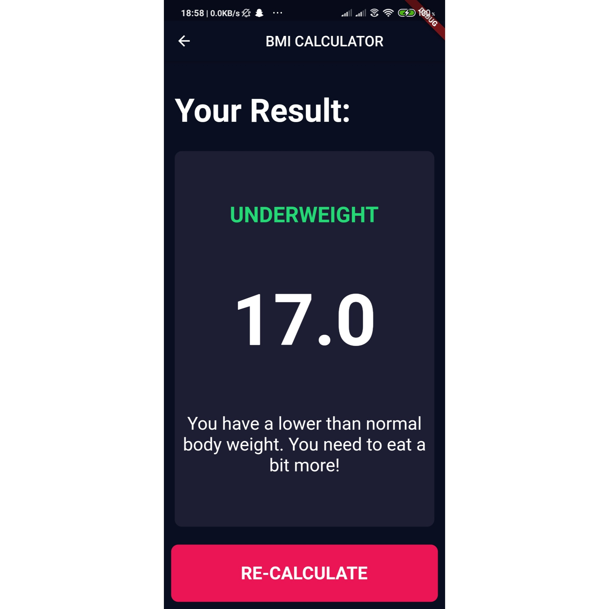

# BMI Calculator

A beautiful Flutter application which calculates your BMI (BODY MASS INDEX) by taking certain inputs
and returns the BMI along with the interpretation messages.

This project contains customised Flutter widgets to acheive a beautiful user interface.
It is a multi screen app with simple-functionality with full-on custom styling.

## Flow of the Application :-

 1] This is the default screen of the BMI App. You need to select your details respectively.

 

 2] This is a sample data for testing the app with all details. You need to click on calculate button.

 

 3] This is the result screen which will display the BMI as well as respective interpretation.You can
 recalculate with other details just by clicking on the re-calculate button.

 

## Key Functionalities of this app :-

-> Customized Flutter Widgets.

-> Flutter Routes and Navigators.

-> Funcations with parameters passing.

-> Dart Enums and Ternary operators.

-> GestureDetector Widget to detect more than just a tap.

-> Use of Constants in Dart.

- [Lab: Write your first Flutter app](https://flutter.dev/docs/get-started/codelab)
- [Cookbook: Useful Flutter samples](https://flutter.dev/docs/cookbook)

For help getting started with Flutter, view our
[online documentation](https://flutter.dev/docs), which offers tutorials,
samples, guidance on mobile development, and a full API reference.
